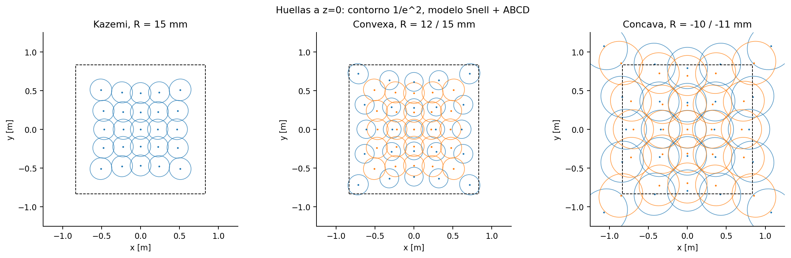
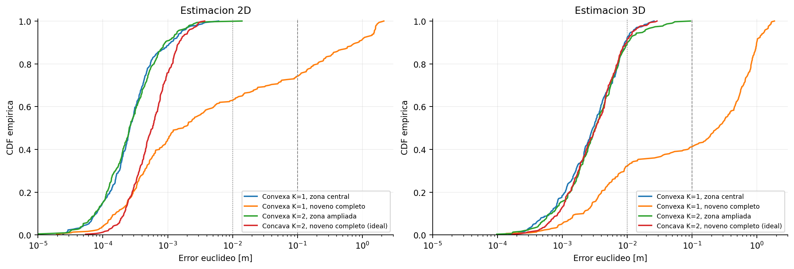
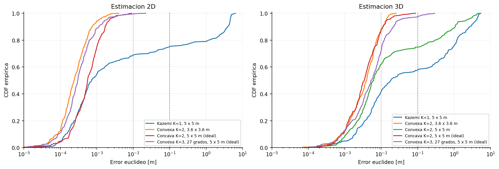
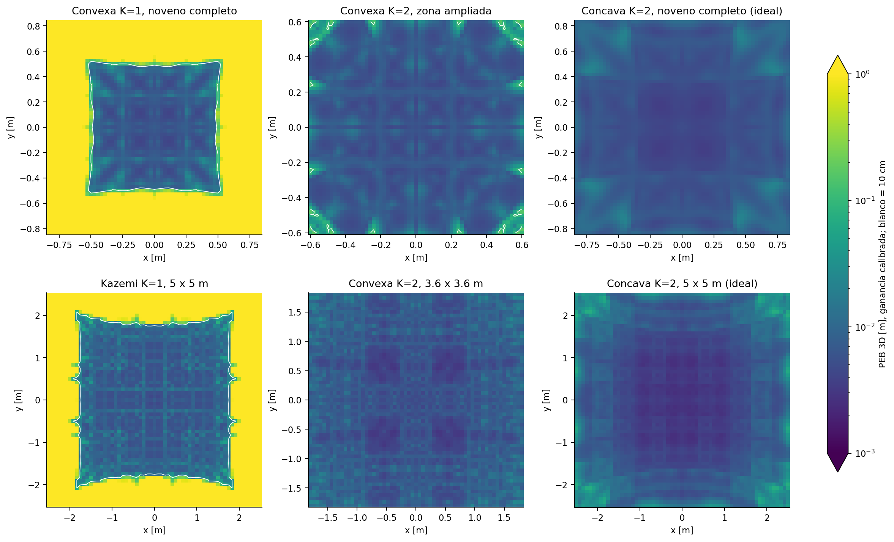
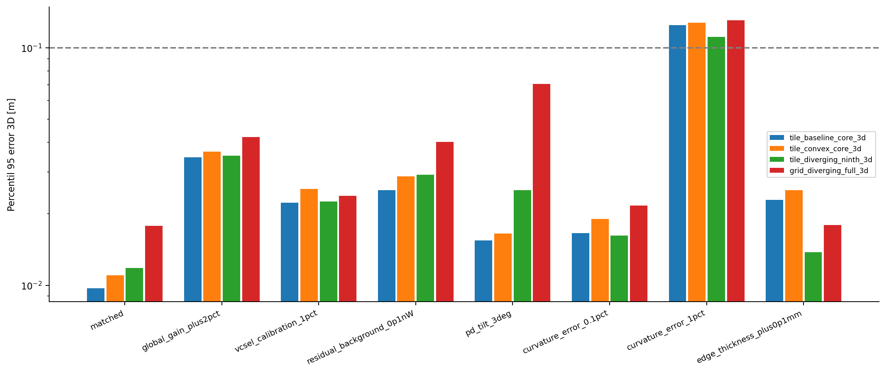

# Posicionamiento con un tile VCSEL 5×5, una lente común y un único PD

## 1. Pregunta y alcance de la respuesta

Se estudia el vector de **potencias individuales identificadas**, no la suma de los 25 haces. La arquitectura transmisora inicial es la de Kazemi, *A Novel Terabit Grid-of-Beam Optical Wireless Multi-User Access Network with Beam Clustering*, fuente local `../A Novel Terabit Grid-of-Beam Optical/Hossein_TCOM_Final_arXiv.tex`.

La respuesta tiene tres niveles distintos:

1. **Identificabilidad:** ¿cambian las observaciones en tres direcciones independientes al mover el PD?
2. **Estimación con ruido:** ¿se recupera la posición sin inicializar el algoritmo cerca de la posición verdadera?
3. **Validez física:** ¿la aproximación óptica utilizada sigue siendo razonable al modificar la lente?

**Sí se puede estimar 2D y 3D con un único PD en una región local útil, incluso con una sola focal, si las potencias absolutas y la orientación del PD están calibradas.** Esto no significa que cualquier punto del noveno nominal de una habitación sea localizable con los parámetros originales. Tampoco significa que un barrido de focal permita obtener una altura robusta con ganancia absoluta desconocida.

La simulación reproduce el modelo de Snell + ABCD de Kazemi, generalizado a altura variable y con las posiciones de salida de los haces explícitas. Las cifras de error son resultados **condicionados a este modelo y a las hipótesis de calibración**; no son resultados experimentales ni una certificación de una lente comercial.

### Resumen numérico de las soluciones convexas principales

Cada entrada usa 300 posiciones aleatorias y potencias/normal del PD calibradas. Los errores son euclídeos, no errores por eje.

| Arquitectura | Estados R [mm] | Sección útil ensayada a z = 0 | P95 error 2D | P95 error 3D |
|---|---|---|---:|---:|
| Un tile, configuración mínima | 15 | 0.90×0.90 m² | 1.63 mm | 12.17 mm |
| Un tile, región ampliada | 12, 15 | 1.20×1.20 m² | 1.40 mm | 17.91 mm |
| Nueve tiles, inclinación original 21° | 12, 15 | 3.60×3.60 m² | 1.12 mm | 13.77 mm |

En 3D las regiones se contraen con la altura según la sección 6, con 0 ≤ z ≤ 1 m. No son prismas. En esos tres casos no hubo errores mayores de 10 cm entre las 300 posiciones aleatorias de cada prueba, pero **el tile ampliado tuvo un error de 236 mm en uno de los puntos estructurados de frontera**. En el núcleo del tile y en la región 3.6×3.6 del AP completo, los máximos de las pruebas estructuradas 3D fueron 14.21 y 12.84 mm, respectivamente.

Para no seleccionar solo los casos favorables: con R = 15 mm en todo el noveno nominal de un tile, el P95 3D fue 1.311 m y solo 41% de los ensayos quedó por debajo de 10 cm. En toda la huella 5×5 m² del AP original, el P95 3D fue 4.082 m y solo 57.67% quedó por debajo de 10 cm. Esto no invalida el artículo de comunicaciones; muestra que cobertura de comunicación y de posicionamiento con un PD único no son equivalentes.

## 2. Qué se conserva del artículo y qué no

### 2.1 Parámetros transmisores conservados

| Parámetro | Valor |
|---|---:|
| Array de un tile | 5×5 VCSELs, identificados individualmente |
| Pitch inicial, δ | 2 mm |
| Coordenadas de centros | −4, −2, 0, 2, 4 mm por eje |
| Separación array–cara plana, dVL | 5 mm |
| Longitud de onda, λ | 950 nm |
| Waist inicial, w0 | 5 µm |
| Índice de la lente, n | 1.55 |
| Diámetro de la lente, L | 16 mm |
| Curvatura inicial, R | 15 mm |
| Focal inicial, f = R/(n−1) | 27.2727 mm |
| Potencia por VCSEL activo | 10 mW |
| AP completo | 9 tiles, 225 VCSELs |
| Separación mecánica entre tiles | 20 mm |
| Inclinación de los tiles periféricos | 21° según las matrices del artículo |

El tamaño de aproximadamente 1 cm² es el de la implantación del array. El cuadrado delimitado por los centros extremos tiene lado 8 mm; no se confunden ambos tamaños.

### 2.2 Hipótesis adicionales, no valores atribuidos a Kazemi

- Un **solo PD de área activa 1 mm²**, sin CPC, sin ganancia de concentración y sin diversidad angular receptora.
- Normal del PD conocida: `nPD = (0,0,1)`. Semicampo de visión: 70°.
- Transmisión óptica conocida η = 0.90, constante en el modelo inicial.
- El artículo no proporciona el espesor central numérico de la lente. Se supone un espesor de borde `te = 2 mm` para la familia convexa. Esto fija el espesor central a partir de la sagita; en R = 15 mm resulta `tc = 4.3114 mm`.
- Al cambiar R se conserva el borde y cambia el espesor central. Es una **familia geométrica de lentes**; no se supone que todo actuador real siga esa ley sin calibración. No se impone conservación de volumen de un líquido.
- Referencia vertical: centro del array central a z = 3 m; el plano receptor de referencia es z = 0. Las salidas de los haces están varios milímetros por debajo del array.
- Se modelan LoS, VCSEL monomodo TEM00, M² = 1, receptor inmóvil durante la adquisición, pilotos separados y ausencia de oclusiones. No se simulan reflexiones de paredes, saturación, interferencia de pilotos ni cuantización del ADC.

El receptor de Kazemi contiene siete elementos angulares con CPC y arrays de PDs. **No se ha reutilizado su ganancia receptora ni su rendimiento de comunicaciones para este PD único.**

### 2.3 Convenciones y erratas relevantes del manuscrito

Se usan las ecuaciones de refracción y ABCD de la sección III y la tabla de parámetros de la sección V. La parte NOMA/OFDMA y el clustering de datos no generan diversidad adicional en este experimento: los pilotos se identifican por separado.

En la expansión de `Eq:TxEl_Coordinates`, el primer componente del producto de rotaciones debe contener `−dc cos(α) sin(β)`, no `−dc sin(α) cos(β)`. Se implementa directamente el producto matricial, evitando esa inconsistencia tipográfica.

Si la dirección del haz apunta del techo hacia el receptor y la normal del PD apunta hacia arriba, el coseno de incidencia físico es `−nPD·v`, no `nPD·v`. El signo escrito en el canal del artículo sería incompatible con esas dos convenciones. Se corrige explícitamente.

En lugar de aproximar todos los haces por el origen del tile, se utiliza el punto real de salida de cada VCSEL y estado. La propagación posterior incluye la parte real del q de salida; no se vuelve a colocar artificialmente el waist en la superficie de la lente.

## 3. Desarrollo del modelo óptico

Todas las magnitudes del código están en unidades SI.

### 3.1 Superficie de la lente y direcciones

Para `m,n = 1,…,5`, `i = 5(m−1)+n`, se toman

\[
x_i=(n-3)\delta,\qquad y_i=(3-m)\delta,\qquad \rho_i^2=x_i^2+y_i^2.
\]

Para un estado convexo de curvatura Rk > 0:

\[
t_{c,k}=t_e+R_k-\sqrt{R_k^2-(L/2)^2},
\]
\[
\tau_{i,k}=\sqrt{R_k^2-\rho_i^2}+t_{c,k}-R_k,
\qquad
\mathbf o_{i,k}^{\rm local}=[x_i,y_i,d_{VL}+\tau_{i,k}]^T.
\]

La normal exterior de la superficie es

\[
\mathbf n_{i,k}=\frac{[x_i,y_i,\sqrt{R_k^2-\rho_i^2}]^T}{R_k}.
\]

La dirección de entrada axial es ez. Aplicando Snell en el paso n → 1:

\[
\mathbf v_{i,k}=n\mathbf e_z+
\left[\sqrt{1-n^2(1-(\mathbf n_{i,k}\cdot\mathbf e_z)^2)}
-n(\mathbf n_{i,k}\cdot\mathbf e_z)\right]\mathbf n_{i,k}.
\]

Esto reproduce el Q del artículo:

\[
Q_{i,k}=\frac{\sqrt{R_k^2-n^2\rho_i^2}-n\sqrt{R_k^2-\rho_i^2}}{R_k^2},
\]
\[
\mathbf v_{i,k}=[Q_{i,k}x_i,Q_{i,k}y_i,
 n+Q_{i,k}\sqrt{R_k^2-\rho_i^2}]^T.
\]

Por tanto, **al cambiar R cambia la dirección de cada VCSEL off-axis**. No se cambia exclusivamente una divergencia introducida a mano.

Se comprueba que los rayos principales caben en la apertura, que existe la superficie esférica, que el espesor es positivo y que no hay reflexión interna total del rayo principal. También se limita una cota conservadora de clipping de la envolvente Gaussian en la apertura. Esto no excluye reflexión interna total de rayos de las colas; la comprobación independiente de rayos precisamente permite detectarla.

### 3.2 Transformación Gaussian completa

\[
z_R=\frac{\pi w_0^2}{\lambda},\qquad q_{in}=d_{VL}+jz_R.
\]

Para cada pareja VCSEL–estado:

\[
A=1,\quad B=\frac{\tau_{i,k}}n,\quad
C=\frac{1-n}{R_k}=-\frac1{f_k},\quad
D=1-\frac{\tau_{i,k}}{nf_k},\qquad f_k=\frac{R_k}{n-1}.
\]

\[
q^{out}_{i,k}=\frac{Aq_{in}+B}{Cq_{in}+D}=a_{i,k}+jb_{i,k}.
\]

El determinante AD−BC es uno. En particular, con `u = dVL + τ/n`,

\[
b_{i,k}=\frac{z_R}{(1-u/f_k)^2+(z_R/f_k)^2},
\]
\[
a_{i,k}=\frac{u(1-u/f_k)-z_R^2/f_k}{(1-u/f_k)^2+(z_R/f_k)^2}.
\]

Después de recorrer una distancia axial s desde la salida:

\[
q_{i,k}(s)=a_{i,k}+s+jb_{i,k},\qquad
w_{i,k}^2(s)=\frac\lambda\pi\frac{(a_{i,k}+s)^2+b_{i,k}^2}{b_{i,k}}.
\]

El modelo permite así que varíen simultáneamente la dirección, la ubicación del waist virtual, el Rayleigh de salida y el tamaño de haz. El espesor recorrido depende del VCSEL, por lo que tampoco se impone un único q para todo el array.

### 3.3 Potencia de un único PD

Para un punto global p y la salida global o:

\[
\mathbf d=\mathbf p-\mathbf o,\quad s=\mathbf d^T\mathbf v,\quad
\mathbf t=\mathbf d-s\mathbf v,\quad r^2=\|\mathbf t\|^2.
\]

\[
P_{i,k}(\mathbf p)=
\frac{2P_t\eta A_{PD}}{\pi w_{i,k}^2(s)}
\exp\!\left[-\frac{2r^2}{w_{i,k}^2(s)}\right]
\max(0,-\mathbf n_{PD}^T\mathbf v_{i,k})\,
\mathbf 1_{FoV}\mathbf 1_{s>0}.
\]

Se mantiene la aproximación de incidencia del artículo basada en el eje del haz. La dirección local de flujo de un frente Gaussian curvo no coincide exactamente con ese eje; para predicción experimental subcentimétrica debe comprobarse también esa aproximación.

El PD es pequeño frente a las manchas. Una prueba integra numéricamente sobre un cuadrado de 1×1 mm² y comprueba la aproximación puntual en un punto representativo. No se transforma el área del PD en una apertura receptora ficticia.

Las observaciones se concatenan en orden **estado → tile → VCSEL**. Para un tile son 25K medidas; para el AP completo son 225K. Los nueve tiles conservan sus lentes individuales comunes a cada array, sincronizadas al mismo estado k: **el AP completo tiene nueve lentes, no una lente gigantesca para los 225 emisores**.

## 4. Por qué puede funcionar y por qué puede fallar

### 4.1 2D: razones de potencia y etiquetas

Considérese la aproximación de manchas Gaussian de igual ancho w en el plano conocido, con centros bi y ganancias ci:

\[
\log\frac{P_i}{P_j}-\log\frac{c_i}{c_j}
=\frac{4(\mathbf b_i-\mathbf b_j)^T[x,y]^T}{w^2}
-\frac{2(\|\mathbf b_i\|^2-\|\mathbf b_j\|^2)}{w^2}.
\]

Dos diferencias de centros no colineales proporcionan dos ecuaciones independientes para x e y. Esto explica la diversidad ya presente con una lente fija.

La simetría del array no crea necesariamente una ambigüedad: reflejar la posición permuta las potencias de los emisores. **Si las etiquetas se conservan, los vectores son diferentes.** En cambio, sumar todas las potencias pierde esa información; una prueba comprueba que dos posiciones simétricas tienen igual suma y distintos vectores.

La ecuación logarítmica solo explica la geometría. El estimador real **no** toma logaritmos de señales débiles o negativas ni presupone que una cola de potencia arbitrariamente pequeña pueda medirse sin ruido.

### 4.2 3D calibrado: ángulo más escala absoluta

En campo lejano, para una dirección angular u y una distancia d al AP,

\[
\mathbf y(d,\mathbf u)\simeq \frac{\mathbf a(\mathbf u)}{d^2}.
\]

Las relaciones entre canales aportan la dirección angular. Si Pt, transmisión, responsividad/ganancia y área son conocidas, la escala absoluta aporta d. Por eso **K = 1 puede ser suficiente para 3D**: no hace falta que las focales produzcan una firma de profundidad independiente de la potencia absoluta.

### 4.3 Ganancia desconocida: la limitación fundamental

Si hay un factor común g desconocido:

\[
\mathbf y\simeq\frac{g}{d^2}\mathbf a(\mathbf u).
\]

La transformación `(d,g) → (cd,c²g)` deja invariante la observación. Con varios estados:

\[
\mathbf y\simeq\frac{g}{d^2}
[\mathbf a_1(\mathbf u)^T,\ldots,\mathbf a_K(\mathbf u)^T]^T.
\]

**Añadir estados no rompe por sí solo esta invariancia de campo lejano.** Los desplazamientos milimétricos de las salidas y los waists virtuales introducen correcciones que pueden dar rango Jacobiano formal completo, pero su sensibilidad a distancia es muy pequeña.

Ejemplo calculado con el modelo completo: dos posiciones separadas 0.6024 m, alineadas aproximadamente con el mismo rayo del AP, quedan a solo 1.89 unidades de ruido tras ajustar una ganancia común con R = 15 mm; sin ajustar ganancia, la separación de las firmas es 174.65 unidades. La familia cóncava de dos estados da aproximadamente 1.01 frente a 261.25. Son ejemplos de ambigüedad práctica, no una demostración de igualdad exacta del modelo completo.

Para error pequeño, una incertidumbre de ganancia εg produce aproximadamente

\[
\frac{|\Delta d|}{d}\simeq \frac{|\varepsilon_g|}{2}.
\]

A 3 m, 1% de error de escala puede representar unos 15 mm de error de distancia. La calibración no es un detalle secundario.

### 4.4 Cobertura luminosa no es cobertura de posicionamiento

Un punto puede recibir una potencia grande de un solo haz. Localmente, eso da aproximadamente una sola ecuación de potencia para tres coordenadas. Para resolver x, y y z hace falta detectar cambios suficientemente independientes en varios canales.

El criterio no es contar 25K números ni declarar rango con precisión arbitraria. Se evalúa el Jacobiano **ponderado por el ruido**, sus valores singulares y los errores de estimación reales. Más pitch puede separar aún más las manchas y reducir el solapamiento necesario. Tampoco ocho estados garantizan arreglar todos los huecos angulares.

## 5. Identificabilidad numérica y estimador

### 5.1 Jacobiano y cota local

Escribiendo W = w², el gradiente implementado es

\[
\nabla W=\frac{2\lambda}{\pi b}(s+a)\mathbf v,
\]
\[
\nabla P=P\left[\left(\frac{2r^2}{W^2}-\frac1W\right)\nabla W
-\frac{4\mathbf t}{W}\right].
\]

Con J el Jacobiano de las potencias y Σ la covarianza de ruido,

\[
J_w=\Sigma^{-1/2}J,\qquad F=J_w^T J_w,
\qquad \mathrm{PEB}=\sqrt{\operatorname{tr}(F^{-1})}.
\]

Para 2D se seleccionan las columnas x,y; para 3D se utilizan las tres. La inversión se implementa por SVD. Un punto sin rango suficiente devuelve infinito, **no cero a través de una pseudoinversa**. Los umbrales de rango son `smin > 10⁻⁹ smax` y `smin > 10⁻¹²` en el Jacobiano ponderado.

Se trata de la información de la media con la covarianza fijada en el punto de evaluación. El ruido es ligeramente heteroscedástico; no se utiliza el término de información debido a derivadas de su varianza para fingir una fuente adicional de información de posición. Es una cota local aproximada, no una garantía global ni una cota aplicable sin matices al estimador sesgado cerca de las fronteras.

Para ganancia desconocida se proyectan las columnas de posición fuera del espacio de la derivada de ganancia, equivalente al complemento de Schur. También se incluye el control de una ganancia independiente por estado, que nunca mejora la información.

### 5.2 Recuperación de la posición

Se minimiza el residuo de potencia en unidades de ruido:

\[
\widehat{\mathbf p}=\arg\min_{\mathbf p\in\mathcal B}
\sum_\ell\frac{(y_\ell-P_\ell(\mathbf p))^2}{\widehat\sigma_\ell^2}.
\]

Los pesos se calculan a partir de la medida, con potencia negativa limitada a cero **solo dentro de la función de varianza**. No se utilizan las potencias verdaderas para fijar pesos del estimador. Las medidas negativas de pilotos tras sustraer el fondo se conservan en el residuo.

La inicialización combina una biblioteca espacial y dos criterios de búsqueda: distancia ponderada de potencias y distancia de firmas comprimidas con `asinh(P/σoscuro)`. La compresión se usa únicamente para localizar candidatos y evitar que el error de discretización de un canal fuerte oculte el mínimo correcto. El ajuste final siempre se realiza en potencia, con Jacobiano analítico y múltiples arranques espacialmente separados.

La malla de inicialización no contiene las posiciones de Monte Carlo. No se entrega al optimizador la posición verdadera, el tile más cercano ni el VCSEL dominante correcto. El código conserva mínimos alternativos y sus diferencias de coste.

Se detectó un caso del AP completo donde la búsqueda basada solo en coste ponderado terminaba a 1.396 m de la verdad a pesar de una PEB local de 0.174 mm. Se reprodujo, se corrigió la inicialización y se añadió una prueba de regresión. Esto ilustra por qué se evalúa la estimación y no solo la cota.

### 5.3 Qué significa la comprobación de unicidad

Se combinan:

- rango y condicionamiento sobre mallas;
- recuperación sin ruido desde biblioteca global;
- Monte Carlo con ruido;
- puntos de frontera, ejes y centro;
- búsqueda de firmas de puntos de la biblioteca separados al menos 10 cm;
- ejemplos radiales con ganancia libre.

Esto es evidencia numérica sobre un dominio delimitado. **No es una demostración matemática de inyectividad global del modelo exacto continuo.** La distancia mínima entre firmas muestreadas tampoco es una cota sobre todos los puntos no muestreados.

## 6. Dominios de evaluación: no ocultar el tamaño de la región

Para un semiancho a en el plano z = 0 se define

\[
\mathcal V_a=\{(x,y,z):0\le z\le1,\ |x|,|y|\le a(3-z)/3\}.
\]

Es un tronco de pirámide, coherente con que la huella angular del tile se contrae al acercarse al AP. En 2D se estudia su sección z = 0. El estimador busca dentro de la caja envolvente; no se le proporciona la relación del borde del tronco para determinar la altura.

| Dominio | Sección a z = 0 | Sección a z = 1 | Interpretación |
|---|---|---|---|
| a = 0.45 m | 0.90×0.90 m² | 0.60×0.60 m² | Núcleo local de un tile |
| a = 0.60 m | 1.20×1.20 m² | 0.80×0.80 m² | Región ampliada del tile |
| a = 5/6 m | 1.667×1.667 m² | 1.111×1.111 m² | Noveno nominal de 5×5 m² |
| a = 1.80 m | 3.60×3.60 m² | 2.40×2.40 m² | Región central del AP completo |
| a = 2.50 m | 5.00×5.00 m² | 3.333×3.333 m² | Huella completa de referencia del AP |

Se prueban además los **prismas** `|x|,|y| ≤ a`, `0 ≤ z ≤ 1` para a = 5/6 y a = 2.5. Sus esquinas superiores son más exigentes. Un resultado favorable en el tronco no se presenta como cobertura de todo el prisma o de todo el volumen 5×5×3 m³ de la habitación.

La afirmación del artículo «aproximadamente un noveno» no implica nueve cuadrados iguales perfectamente localizables. Se muestran tanto un noveno nominal como regiones efectivamente útiles, sin confundirlas.

## 7. Ruido, presupuesto de medida y protocolo

La varianza de potencia equivalente es

\[
\sigma_P^2=\frac{B}{\mathcal R^2}
\left[\frac{4k_BT}{R_f}+i_a^2+2q_e(\mathcal RP+I_{bg})
+\mathrm{RIN}(\mathcal RP)^2\right]+(\epsilon P)^2.
\]

| Parámetro adicional | Valor |
|---|---:|
| Responsividad, ℛ | 0.7 A/W |
| Temperatura | 300 K |
| Resistencia equivalente de realimentación | 10 kΩ |
| Densidad de ruido del amplificador | 2 pA/√Hz |
| Corriente de fondo, con media sustraída | 10 µA |
| RIN | −155 dB/Hz |
| Fluctuación multiplicativa independiente por piloto, ε | 0.5% |
| Ancho de banda equivalente de referencia | 100 Hz |
| σ de potencia sin señal a 100 Hz | 42.53 pW |

Para K estados se usa **B = 100K Hz por piloto**. Con integración rectangular `Tint = 1/(2B)`, el tiempo total de integración es 125 ms por tile y 1.125 s para los nueve tiles, independientemente de K. No se añade gratuitamente tiempo de integración al añadir estados.

La fluctuación multiplicativa de 0.5% se modela independiente entre pilotos, no como error de calibración fijo. Repetir un mismo estado puede promediar esa componente. Por ello se incluye el control de K = 2 y K = 8 **repitiendo exactamente R = 15 mm**. Las mejoras geométricas se comparan con esos controles. Los errores fijos por VCSEL se prueban aparte.

Los tiempos no incluyen asentamiento de la lente, comunicaciones, reinicio del TIA ni procesamiento. Un barrido secuencial completo de 225 emisores es lento para un receptor móvil. Usar pilotos ortogonales puede reducir latencia, pero requeriría otro análisis de ruido e interferencia: no se equipara sin más a esta adquisición secuencial.

Se utilizan 300 posiciones aleatorias por caso, semilla 20260912, más 9 puntos estructurados para 2D y 27 para 3D. Las posiciones aleatorias 3D son uniformes en volumen del dominio correspondiente. Las mallas finales tienen 61×61 puntos en 2D y 61×61×5 en 3D, incluidos bordes. El barrido de diseño usa otra discretización más gruesa. La fracción de puntos de malla y la fracción Monte Carlo no son la misma medida volumétrica.

Los resultados contienen intervalos de Wilson al 95% para la tasa de fallos mayores de 10 cm. **Cero fallos en 300 ensayos no demuestra una probabilidad de fallo nula**: el extremo superior del intervalo es aproximadamente 1.26%.

## 8. Configuraciones ensayadas y resultados

Las tablas completas, con RMSE por coordenada, máximos, percentiles, errores de frontera, rango, PEB y comprobaciones sin ruido, están en:

- `results/summary_tile.csv`: casos de un tile.
- `results/summary_grid.csv`: casos de nueve tiles.
- `results/design_sweep.csv`: barrido de pitch y estados convexos; también variantes de distancia array–lente, waist y tamaño de array.
- `results/diversity_controls.csv`: repetición de estados frente a diversidad real y ganancias nuisance.
- `results/grid_tilt_sweep.csv`: barrido de inclinación del AP completo.
- `results/noise_area_tradeoff.csv`: sensibilidad al área del PD y al tiempo de integración.

El modelo inicial R = 15 mm produce un radio de haz central de aproximadamente 130 mm a 3 m. Al pasar a R = 12 mm el haz central se estrecha y las direcciones off-axis se separan más. Un mismo PD puede recibir canales diferentes con gradientes diferentes entre esos dos estados.

Las configuraciones principales son:

- **A — mínima:** pitch 2 mm, R = 15 mm, K = 1, sin modificar los VCSELs.
- **B — extensión convexa moderada:** pitch 2 mm, R = {12,15} mm, K = 2; f = {21.818,27.273} mm.
- **C — barrido convexo amplio:** R = {10,11,12,13,15,17,20,25} mm, K = 8. Control de si muchos estados solucionan los huecos.
- **D — extensión divergente exploratoria:** R = {−10,−11} mm, borde 6 mm, K = 2; f = {−18.182,−20.000} mm. Conserva el array, el pitch, w0 y dVL; cambia la familia de lente a plano-cóncava.
- **E — AP con inclinación reajustada:** nueve tiles, 27° en vez de 21°, R = {10,12,15} mm. Es una modificación mecánica y óptica explícita, no la reproducción literal del AP original.

La extensión cóncava utiliza la normal `n = [x/R,y/R,sqrt(1−ρ²/R²)]` y el espesor `τ = tc + sign(R)(sqrt(R²−ρ²)−|R|)`, con `tc = te + sign(R)(|R|−sqrt(R²−(L/2)²))`. **No se obtiene cambiando solo el signo de una divergencia.** Se recalculan Snell y ABCD, y se prueban sus identidades.

### Resultados de las ampliaciones exploratorias

| Configuración y dominio 3D | Mediana | P95 | Ensayos con error < 10 cm |
|---|---:|---:|---:|
| C: ocho estados convexos, noveno del tile | 4.30 mm | 429.32 mm | 83.00% |
| D: dos estados cóncavos, noveno del tile | 3.30 mm | 12.03 mm | 100.00% |
| D: dos estados cóncavos, AP, tronco de base 5×5 m² | 3.45 mm | 14.42 mm | 100.00% |
| E: AP a 27°, tres estados convexos, tronco de base 5×5 m² | 5.37 mm | 32.42 mm | 97.00% |
| D: AP, prisma 5×5×1 m³ | 4.63 mm | 374.58 mm | 88.67% |

**D y E son resultados del modelo Gaussian circular concordante, no una recomendación validada de hardware.** La sección 9 muestra por qué sus mejores cifras deben considerarse provisionales. E también presenta un error de 437.76 mm en la prueba estructurada de frontera, y el máximo del prisma D supera 5 m.

Al estimar además una ganancia común desconocida, el núcleo del tile A pasa a mediana 445.00 mm y P95 956.40 mm. En D con los nueve tiles, la mediana es 46.28 mm pero el P95 sigue en 908.83 mm: la pequeña diversidad de orígenes puede ayudar en algunas zonas sin dar una solución de altura uniformemente robusta.

### Lectura principal de los resultados

- A permite localizar en el núcleo del tile; no justifica cobertura robusta del noveno completo.
- B amplía la región útil, aunque aparecen puntos de frontera desfavorables. Una buena mediana no se interpreta como una garantía en cada punto.
- C mejora algunas zonas respecto a un único estado, pero no convierte automáticamente todo el noveno en localizable. No se recomienda multiplicar K indiscriminadamente.
- D da resultados favorables en el modelo circular, pero **no pasa una comprobación física suficientemente estricta para aceptar sus cifras milimétricas sin revisar el modelo de haz**.
- Los nueve tiles aportan señales entre regiones vecinas y mejoran la continuidad dentro del área efectivamente iluminada. Sin embargo, las esquinas de la huella nominal y del prisma siguen siendo pruebas necesarias.
- E puede mejorar la distribución de cobertura, pero el estado R = 10 mm requiere un modelo off-axis más preciso. No se atribuye a Kazemi ni se presenta como hardware validado.

### Figuras de la simulación

Las figuras también se guardan como PDF en `results/figures`. Las áreas comparadas están indicadas en cada leyenda; las CDF 3D usan los troncos definidos anteriormente.









## 9. Comprobación independiente por trazado de rayos

`ray_validation.py` no utiliza la fórmula Q ni la matriz ABCD para propagar los rayos. Genera 200000 rayos por haz representativo a partir de la distribución de fase Gaussian del waist: desviaciones de posición w0/2 y de pendiente λ/(2πw0), con muestras antitéticas. Refracta en la cara plana, calcula la intersección exacta con la superficie esférica, vuelve a aplicar Snell, descarta reflexión interna total y propaga hasta el plano receptor.

Se comparan centroide, radios principales por segundos momentos, pérdidas y momento cuarto con el modelo circular de Kazemi. Es una comprobación geométrica independiente; no es una simulación electromagnética completa, una réplica de Zemax ni una medida de laboratorio. No incluye Fresnel angular ni dispersión superficial.

Resultados representativos en los VCSELs de esquina:

| Estado | Radio menor rayos / ABCD | Radio mayor rayos / ABCD | Desplazamiento centroide | Fracción TIR |
|---|---:|---:|---:|---:|
| R = +15 mm, borde 2 mm | 0.950 | 1.008 | 0.439 mm | 0 |
| R = +12 mm, borde 2 mm | 0.874 | 0.894 | 0.221 mm | 0 |
| R = +10 mm, borde 2 mm | 0.309 | 0.594 | 1.370 mm | 0 |
| R = −10 mm, borde 6 mm | 1.168 | 2.570 | 65.95 mm | 1.9805% |
| R = −11 mm, borde 6 mm | 1.108 | 1.900 | 34.72 mm | 0.0225% |

Esto tiene consecuencias importantes:

1. En R = 15 mm la comprobación es razonablemente próxima al modelo inicial, pero **un 5% de error de ancho puede afectar mucho a las colas de intensidad**. Para prometer precisión milimétrica haría falta calibrar la forma real.
2. R = 12 mm ya muestra diferencias de aproximadamente 10–13% en una esquina. El estado es físicamente definido, pero las cifras del estimador con modelo perfectamente concordante siguen siendo optimistas para hardware sin calibración.
3. R = 10 mm y las focales negativas fuertes presentan astigmatismo que no se puede ignorar. El hecho de que el rayo principal no sufra TIR no garantiza que no la sufran las colas.
4. **No se recomienda fabricar una solución cóncava basándose únicamente en sus buenas CDF del Gaussian circular.** Antes debe usarse un modelo astigmático/no paraxial o una calibración medida de las firmas, y repetirse el mismo protocolo de identificabilidad y estimación.

Este contraste evita seleccionar la configuración que arroja el mejor número dentro de un modelo fuera de su rango de validez.

## 10. Robustez, realismo y límites

`results/robustness.csv` evalúa además, manteniendo el modelo del estimador nominal:

- +2% de ganancia común;
- 1% de error fijo independiente por VCSEL, compartido entre sus estados;
- 0.1 nW de fondo residual;
- inclinación del PD de 3° no comunicada al estimador;
- errores de curvatura de 0.1% y 1%;
- error de espesor de borde de +0.1 mm.

Se ejecutaron 100 posiciones por perturbación y configuración, 3200 estimaciones en total. En el núcleo del tile A, el P95 fue 9.71 mm para el control concordante de este segundo experimento; pasó a 34.53 mm con +2% de ganancia, 22.24 mm con errores fijos de 1% por VCSEL, 16.57 mm con 0.1% de error de curvatura y 124.35 mm con 1% de error de curvatura. Por tanto, una simulación concordante milimétrica no permite tolerar sin más errores porcentuales de lente.



El barrido adicional de área del PD mantiene fijos el ruido del amplificador y la corriente de fondo. No incluye el aumento de capacitancia ni el cambio de fondo ambiental que podría acompañar a un PD más grande. Es una sensibilidad controlada, no una optimización electrónica de un componente comercial.

Estos ensayos son sensibilidad paramétrica, no sustituyen una comparación de estimación usando irradiancias completas procedentes de ray tracing. La comprobación de rayos de la sección anterior compara haces; **no se ha simulado una estimación extremo a extremo con un receptor real ni se ha demostrado el rendimiento de D bajo aberraciones reales**.

No se ha identificado ni validado un componente comercial que produzca exactamente todas las curvaturas, espesores, aperturas y tiempos supuestos. Por ejemplo, B requiere potencias ópticas de aproximadamente 45.83 y 36.67 dioptrías en una apertura de 16 mm. D requiere −55 y −50 dioptrías. Una lente comercial descrita solo por su rango de focal no basta: también importan apertura útil, superficies, índice, aberraciones off-axis, repetibilidad, histéresis y tiempo de asentamiento.

Los 10 mW se adoptan para comparar con el artículo. **No constituyen una autorización de seguridad ocular para los estados modificados.** No se han certificado IEC/ANSI, estados transitorios ni condiciones de acceso directo al emisor. Todos los resultados son simulaciones.

## 11. Decisión de diseño

La primera implementación recomendada es la más simple:

1. Un tile 5×5 con pitch 2 mm, los VCSELs originales y una lente común en R = 15 mm.
2. Un PD único con normal conocida y electrónica de potencia absoluta calibrada.
3. Pilotos identificados y ajuste conjunto de todas las potencias; no únicamente seleccionar el VCSEL de mayor potencia.
4. Declarar inicialmente una región local delimitada, no toda la habitación.
5. Añadir un segundo estado convexo solo si se necesita ampliar la región, comprobando experimentalmente su patrón off-axis.

Para el AP completo, la misma lógica se aplica a las 225 etiquetas y a una lente por tile. Los resultados del AP original, del mismo barrido de dos estados y de las variantes están separados. El reajuste de inclinación y la extensión cóncava son rutas de investigación, no sustitutos silenciosos del diseño de Kazemi.

**Conclusión:** el cuello de botella no es tener un solo PD. Con identificación de los VCSELs hay diversidad transmisora suficiente para 2D y, con escala absoluta conocida, para 3D en una región adecuada. Los problemas reales son el solapamiento detectable, la cobertura declarada, la calibración de la escala y la validez del modelo óptico al cambiar la focal. Más separación entre VCSELs o más estados no arreglan automáticamente esos problemas.

## 12. Reproducción y uso

Entorno utilizado: Python 3.12.8, NumPy 1.26.4, SciPy 1.14.0 y Matplotlib 3.9.0. No se requiere MATLAB ni Zemax.

Verificación final: **18 pruebas automáticas aprobadas; 25 casos de estudio y 7500 localizaciones aleatorias verificadas**, además de las fronteras, 3200 ensayos de sensibilidad y 3 millones de rayos en las comprobaciones ópticas. `verify_results.py` recalcula estadísticas desde las estimaciones guardadas y comprueba que las medidas sin ruido corresponden a los parámetros del modelo; no se limita a comprobar que existen archivos.

Desde esta carpeta, en PowerShell:

```powershell
$env:OPENBLAS_NUM_THREADS = "1"
$env:OMP_NUM_THREADS = "1"
python -m unittest discover -v
python design_sweep.py
python run_study.py --scope tile --trials 300 --resolution 61
python run_study.py --scope grid --trials 300 --resolution 61 --robustness
python ray_validation.py
python additional_checks.py
python verify_results.py
python plot_results.py
```

Los límites de hilos evitan sobrecarga de BLAS en muchas multiplicaciones pequeñas; no cambian el modelo. Para una pasada breve pueden reducirse `--trials` y `--resolution`, usando otra carpeta de salida para no reemplazar los resultados de referencia.

Demostración funcional de localización, sin proporcionar una posición inicial al optimizador:

```powershell
python localize.py
python localize.py --case tile_convex_core_2d
python localize.py --case grid_convex_core_3d --position 0.8 -0.6 0.4
```

Para potencias externas, un CSV sin cabecera con una potencia por canal, en orden estado/tile/VCSEL:

```powershell
python localize.py --case tile_baseline_core_3d --powers medidas.csv --units nW
```

El CSV debe contener 25, 50, 225, etc. valores según el caso, no una potencia agregada. Las potencias deben estar corregidas del fondo y referidas a la calibración de potencia absoluta del modelo. La salida proporciona posición estimada, residuo y cota local, pero una convergencia numérica no se etiqueta automáticamente como posición fiable.

Los archivos `*_trials.npz` conservan verdad, medidas ruidosas, medias sin ruido, estimaciones, costes, ganancias y mínimos alternativos. Los `*_map.npz` conservan puntos y métricas de identificabilidad. Los manifiestos JSON incluyen parámetros, semillas y versiones; un valor JSON nulo para una métrica no finita significa no acotada/no identificable, nunca cero.
