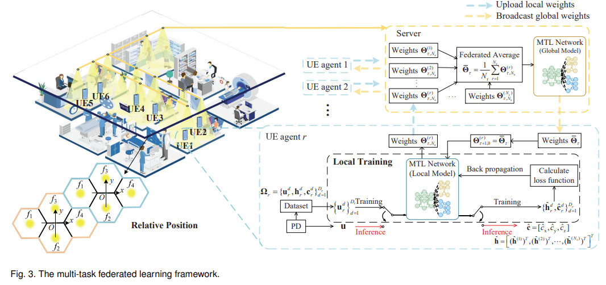

#### Pendientes

* [ ] Realizar las simulaciones para el caso de optimización por cada método.
* [ ] Observaciones en el Paper
* [ ] Definicion del SNR (mix entre Optical y Electrical)
* [ ] INTRODUCCIÓN :  Aqui añadir una tabla con la comparativa de distintos métodos de Single VLP.
* [ ] RESULTADOS: Aqui sería ideal presentar una tabla comparativa de los principales resultados con otros métodos.
* [ ] Corregir las observaciones de LUC, BASTIEN, HONGYU
* [ ] Añadir un parrafo para discutir el SNR.
* [ ] Me falto conversar sobre el ajuste del modelo lambertiano con uno polinomico.

#### Redacción

* [ ] Redactar la INTRODUCCION
* [ ] Reredacción del ABSTRACT
* [ ] Redactar las CONCLUSIONES
* [ ] Llegar a 25 REFERENCIAS

#### Preguntas a resolver:

* Como armonizar las ideas en un escenario beamstearing de OWP y OWC para lograr un ISAC beamstearing y evitar perder el LOS (habitualmente requiero orientaciones heterogeneas para OWP como una "epilepsia", mientras que para "OWC" seria mejor que siga al usuario (puede tener pausas y mirar a cada usuario? es decir el link TX-RX1, Tx-Rx2, Tx-Rx3, ... puede hacerse en diferentes instantes y sin perder performance o BER ? ) ya que de ser el caso entonces podemos anunciar un escenario con N robots (N>=5) donde el mismo link LOS de comunicacion genera informacion para auto-localizarse, es decir con N-robots se no es necesario escoger las N-orientaciones fijas, sino que se puede usar las N-orientaciones que apuntan hacia los N-robots y asi poder estimar la posicion a cada instante de itempo).

**Ideas generales (discusion with Bastien):**

* Eventualmente podría ser una técnica TDMA para el caso de transmistir información beam-steering, de ese modo se puede transmitir a diferentes usuarios en franjas de tiempo.
* Otra idea es la de mantener el OFDM en una especie de Clusters, donde para hacer el posicionamiento se este apuntando al centro de estos cluster alrededor del punto del receptor (K-orientaciones), manteniendo asi la LOS con los receptores en ese cluster. Para otros clusters habrian otros beam-steearing ISAC.
* En el proyecto OPTI-6G para la demostración debo de plantear eventualmente cual sera la arquitectura.
* En el proyecto OPTI-6G se tendrá eventualmente de OLEDCOMM los receptores que tendran salida para OWC y RSS para OWP. Esos se pueden reutilizar en diferntes aplicaciones.
* Aprender a usar el AGW (equipo que genera señales) serviría para conectar al AP PCB Circular de OLEDCOMM; asi se puede tener tambien integrado la comunicacion y posicion para propositos CIENTIFICOS del ISAC, a su vez contamos con un medidor para las caracteristicas del UE donde se tendra que leer potencia AC (considerandose como varianza) porque esta despues de un pasabanda que elimina la parte de la señal DC.
* Es factible traer recursos humanos por 6 meses para que trabajen, con un sueldo de Ingeniero Investigador.

---

JOURNALS TARGET

| Journal                                                    | Time       | Impact Factor | Documents (VLP) | Comment | Experiment                |
| ---------------------------------------------------------- | ---------- | ------------- | --------------- | ------- | ------------------------- |
| IEEE Transactions on Instrumentation and Measurement (TIM) | 21w (5m)   | 5.9 (Q1)     | 14 (2025: 1)    | Good    | Yes (mostly)              |
| IEEE Transactions on Wireless Communications (TWC)         | 35w (9m)   | 10.7 (Q1)    | 10 (2025: 0)    | -       |                           |
| IEEE Transactions on Communications (TCOM)                 | 32w (8m)   | 8.3 (Q1)     | 11 (2025: 3)    | Good    | Experiments / Simulations |
| Journal of Lightwave Technology (JLT)                      | 15.9w (4m) | 4.8 (Q1)      | 21 (2025: 2)    | Good    | Yes (mostly)              |
| Applied Optics                                             | -          | -             | -               | -       |                           |
| IEEE Transactions on Broadcasting                          | 17w (4m)   | 4.8 (Q1)     | 4 (2025: 0)     | -       |                           |
| IEEE Transactions on Green Communications and Networking   | 27w (7m)   | 6.7 (Q1)      | 2 (2025: 2)     | New     |                           |

---

#### PROPUESTAS DE PAPERS

* **(19/09/2025)** "*Estimación de posiciones basado en modulación de la orientación para un canal NO-LAMBERTIANO"*: En este escenario se considera que el LED tiene un patron de emisión NO Lambertiano y eso hace que se modifique cos(phi)^m por f(phi) donde f(phi) tiene que ser aproximado. En una revisión simple se encontro : que u(phi) = log(f(phi))  y se podria aproximar a  u(phi)=**α**+**β**s donde s=nt ⁣⋅ ⁣d.
* (19/09/2025) "Caso de estudio: Estimación 2D single-LED single-PD con estimadores lineales GLS, WLS" Estudio del ratio lineal, simiulación en 1D, linealidad del ratio beta, estimación en 2D empleando modulacion de la orientación con beta, empleando LS y con WLS. Los graficos y analisis se encuentran en fundamentals/LogRatios/1D,2D.m
* (19/09/2025) Applicar **Machine Learning** a todo lo relativo a Single-LED Single-PD Visible Light Positioning. Incluso con datos sintéticos. Además aplicar **ROBOTICA** en el paper y **SISTEMAS DE CONTROL** a fin de hacerlo más interesante. Ver si se aplica también alguna técnica de **IMAGE PROCESSING** y además aplicar **SIGNAL PROCESSING** en algo de TEORIA, SIMULACION E IMPLEMENTACIÓN.
* (25/09/2025) Recordar que tenemos simulación respecto al trackeo del AP apuntando al UE basado en la maximización de la derivada (gradiant ascense). Lo que puede emplearse para maximización del SNR en OWC. A modo de trackeo.
* (25/09/2025) **Coperativo VLC y VLP** (no como ISAC) sino como coperación entre estos. Ref [Visible Light Integrated Positioning and Communication: A Multi-Task Federated Learning Framework].
* 
* 
* Estudio teórico (optimización) y SIMULACIONES de estimación de la posición en 3D empleando N-PD.
* Estudio teórico (optimización), SIMULACIONES y EXPERIMENTAL de la estimación de posición 3D empleando 1PD y N-Transmisores en BeamStearing (N < 4 sería ideal para obtener ventaja frente a las estructuras tradicionales del VLP).
  * Comentario: Este planteamiento debe pensarse con más detenimiento porque la ventaja de usar Single-VLP es el número de Transmisores, pero si este aumenta entonces debe de justificarse su respectivas ventajas ya no solo frente a un Single-VLP sino tambien a un Tradicional VLP (4 Tx fijos)
* asdasd

#### PROPUESTAS DE TRABAJO EN LA PASANTIA

* Sub-Centimeter Indoor Optical Wireless Positioning Using An Optimized Machine Learning Technique. https://www.repository.cam.ac.uk/items/f12f5d6d-8c27-429a-831c-3818e4a486a7
* Desarrollar este GIMBAL modular: https://www.zaber.com/products/gimbal-stages/X-G-RST-DE/specs?part=X-G-RST300-DE50SR10

#### PLAN DE TRABAJO

| MES       | AÑO | OBJETIVO                                                                       | ACTIVIDADES                                            | TEMA DE INVESTIGACION                                | EVENTO                                                    |
| --------- | ---- | ------------------------------------------------------------------------------ | ------------------------------------------------------ | ---------------------------------------------------- | --------------------------------------------------------- |
| SETIEMBRE | 2025 | JOURNAL CSI REGISTRO REINSCRIPCIÓN REVISION JOURNAL IEEE Trans | Revisión Redacción Visa para UK            | 3D Single VLP MODEL-BASED: TEÓRICO/SIMULACIÓN | JOURNAL 1                                                 |
| OCTUBRE   | 2025 | BASE DE DATOS PROCESAR SEÑALES                                           |                                                        | 3D Single VLP MODEL-BASED: EXPERIMENTAL         | ICC 2026 (Scotland, UK) WCNC 2026 (Lumpur, Malaysia) |
| NOVIEMBRE | 2025 | MACHINE LEARNING                                                               | Realizar el entrenamiento empleando ML, DL        | 3D Single VLP DATA-DRIVEN                            | Meeting OPTI-6G (Brunel)                             |
| DICIEMBRE | 2025 | MACHINE LEARNING VACACIONES (20 DIC)                                      | Realizar el entrenamiento con Physics Informed NN | 3D Single VLP DATA-DRIVEN                            | JOURNAL 2                                                 |
| ENERO     | 2026 | VACACIONES                                                                     | VACACIONES                                             | VACACIONES                                           | VACACIONES                                                |
| FEBRERO   | 2026 | NACIMIENTO DE BEBE                                                             | LICENCIA                                               | LICENCIA                                             | LICENCIA                                                  |
| MARZO     | 2026 |                                                                                |                                                        |                                                      | PIMRC 2026                                                |
| ABRIL     | 2026 |                                                                                |                                                        |                                                      | GLOBECOM 2026 (Macao,China)                          |
| MAYO      | 2026 |                                                                                |                                                        |                                                      | IPIN 2026                                                 |
| JUNIO     | 2026 |                                                                                |                                                        |                                                      |                                                           |
| JULIO     | 2026 |                                                                                |                                                        |                                                      |                                                           |
| AGOSTO    | 2026 | VACACIONES                                                                     | VACACIONES                                             | VACACIONES                                           | VACACIONES                                                |
| SETIEMBRE | 2026 | INTERCAMBIO A CAMBRIEGE (Ideal: 15 de setiembre)                          | INTERCAMBIO                                            | POR DEFINIR                                          | POR DEFINIR                                               |
| OCTUBRE   | 2026 | INTERCAMBIO A CAMBRIEGE                                                        | INTERCAMBIO                                            | POR DEFINIR                                          | POR DEFINIR                                               |
| NOVIEMBRE | 2026 | INTERCAMBIO A CAMBRIEGE                                                        | INTERCAMBIO                                            | POR DEFINIR                                          | POR DEFINIR                                               |
| DICIEMBRE | 2026 |                                                                                |                                                        |                                                      |                                                           |
