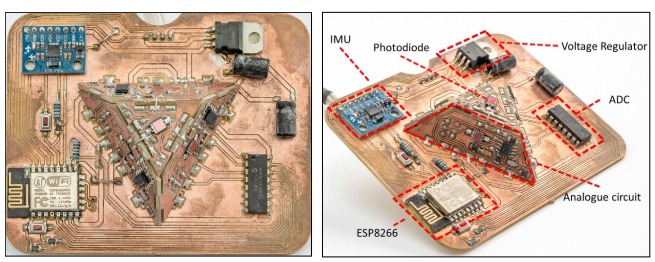
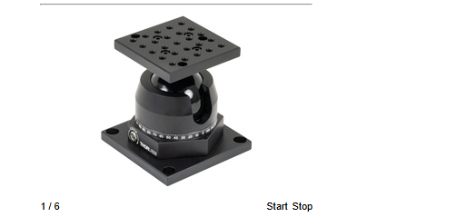
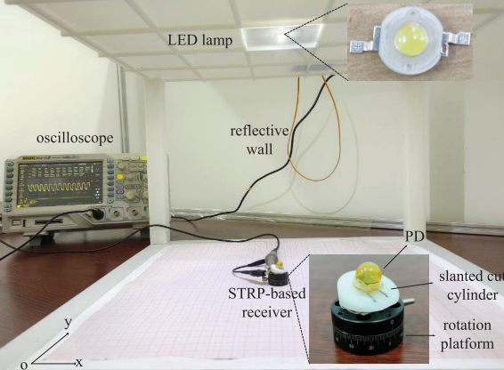

Mejoras para el transmisor:

Desarrollo e implementación de un sistema piramidal para implementar un Angle Diversity Transmitter (ADT) o Multi-Direction LED (MD-LED)

Referencia constructiva:

* Paper: Accurate Visible Light Positioning Using Multiple-Photodiode Receiver and Machine Learning

  
* [Thorlab SL20](https://www.thorlabs.com/thorproduct.cfm?partnumber=SL20#ad-image-0) https://www.thorlabs.com/thorproduct.cfm?partnumber=SL20#ad-image-0

  
* Paper: Design and Performance Analysis for Indoor Visible Light Positioning With Single LED and Single-Tilted-Rotatable PD

  
